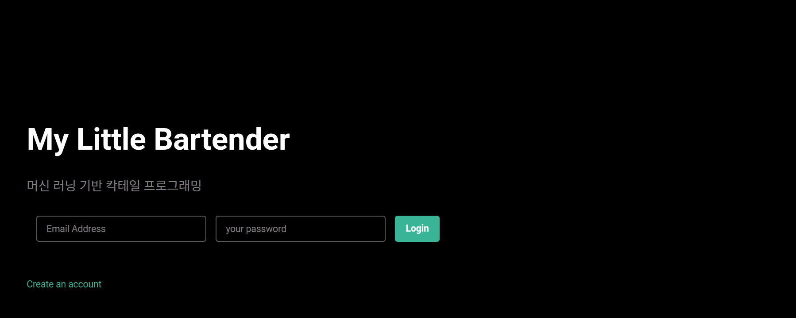
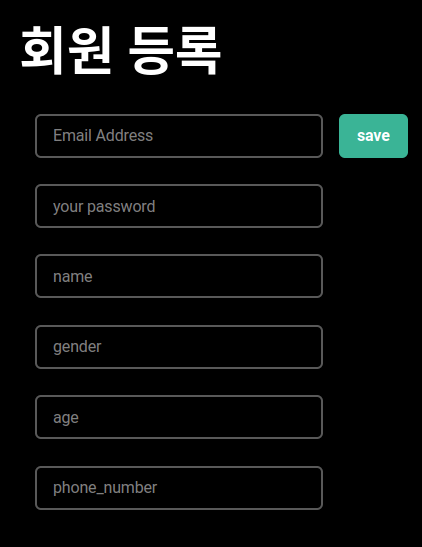
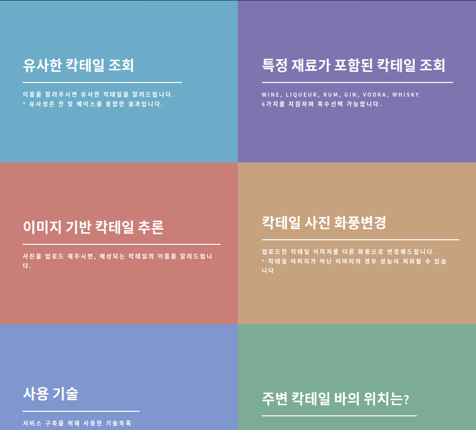
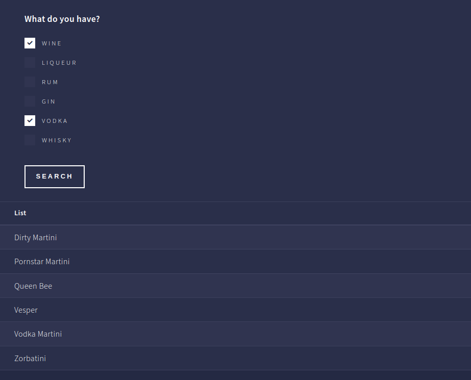
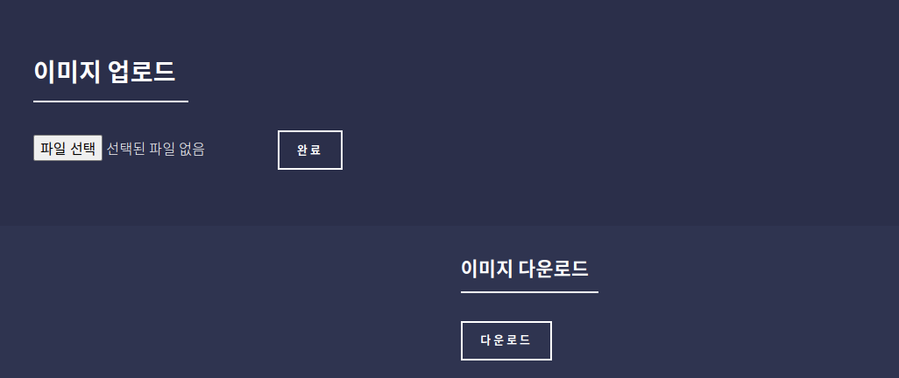
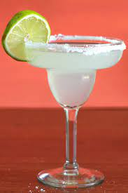

# 칵테일 서비스

## 프로젝트 소개
- 2023.01.27일에 데이터 엔지니어링 과정을 통해, 완성한 프로젝트이다.
- DS쪽에서 완성을 한, 모델을 적재를 하고 서비스를 하기 장고 프로젝트이다.
- 서버 구성 과정: https://velog.io/@woojoo121/series/%ED%94%84%EB%A1%9C%EC%A0%9D%ED%8A%B8%ED%8C%8C%EC%9D%B4%ED%94%84%EB%9D%BC%EC%9D%B8%EA%B5%AC%EC%B6%95

## 프로젝트 제출 서류 모음

<strong>프로젝트서류모음 폴더에 모아두었다.</strong>

### 서비스 종류

1. 유사 칵테일 조회 - clustering
2. 특정 재료가 포함된 칵테일 조회 - elasticSearch 활용
3. 이미지 기반 칵테일 추론 - CNN 모델링
4. 칵테일 사진 화풍변경 - GAN

## 주의
- 프로젝트는 깃 허브 용량상 모델이 적재되어 있지 않아, 정상적인 동작은 안된다.
- 보안상, db 접속 정보를 감춰두었다.
- 용량 초과로 cocktailProject repository 연장선상이다.

## 프로젝트 결과물

### 첫화면

### 회원가입 화면

### 서비스선택 화면

### 유사 칵테일 검색 결과

### 칵테일 이미지 업로드 후, 칵테일 이름 추론

### 재료로 만들 수 있는 칵테일은?

### 화풍 변경

#### 사이트

#### 입력

#### 결과

